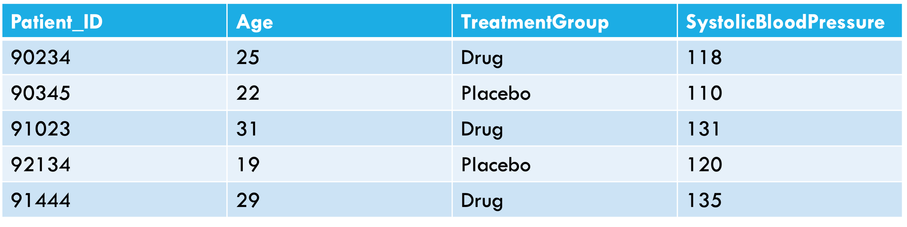
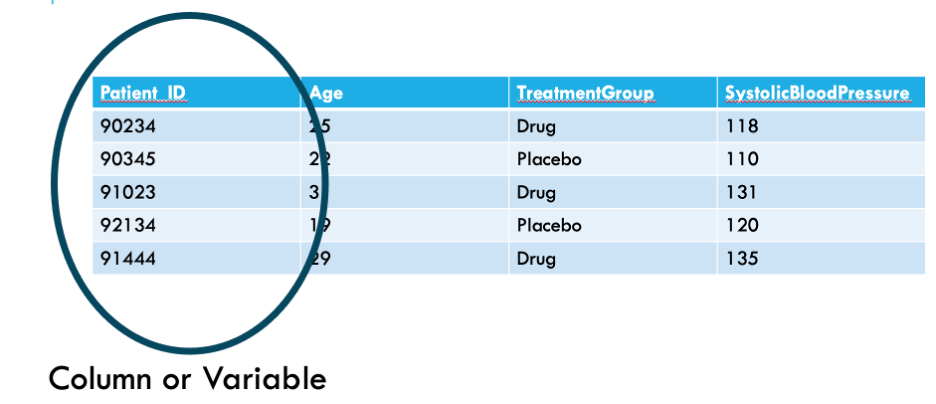
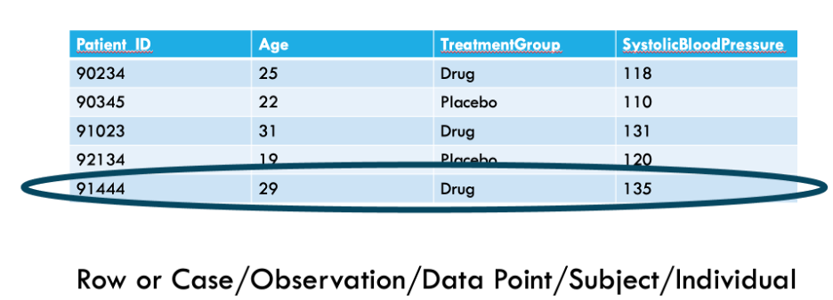
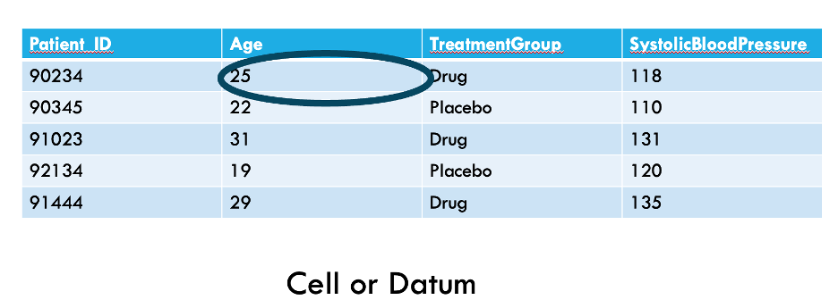
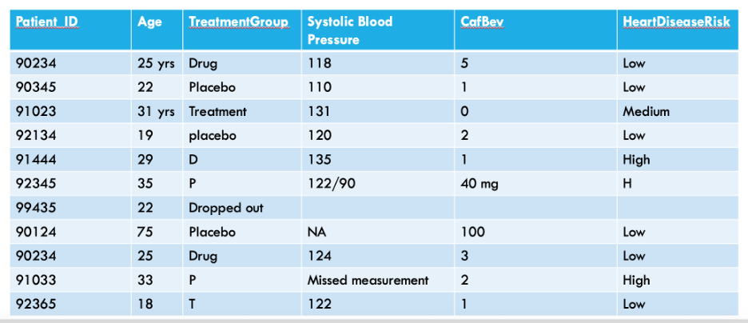

<style>
pre {
  font-size: 0.55em;
}
</style>

```{r setup, include=FALSE}
knitr::opts_chunk$set(echo = TRUE)
```

## Link to today's materials

-   [materials
    repo](https://github.com/EEIDWorkshop2026/materials/tree/main/data_management)

-   In R, go to file--\> new project --\> version control--\>git--\>copy
    and paste the directory name (materials)

-   Make sure materials fills in as the name of the directory

-   **Store in a place you can find!**

-   Open the R script eeid_data_management.R so you can run it
    while I talk

## Field, lab, or software program to R

The first section will focus on best practices for organizing data
**from the field, lab, or elsewhere** that will make the transition to
wrangling it in R easiest.

## Learning objectives

### Improve data management through: {.smaller}

-   Building pipelines
-   File management
-   Maintaining relational structure between data types
-   Meta-data tracking
-   Datasheet format
-   Data management in R using the tidyverse

## Why pipelines?

Pipelines are ways of carefully recording and systematizing the steps
you take to work with your data

### Ideally your project will depend on: {.smaller}

-   Some data files: spreadsheets storing data (.csv files from Excel)
-   Some scripts (more on this later)
-   Something that tells you how these things go together: README file
- https://github.com/DataInvestigations/bats_group_project/blob/main/README.md

## Getting started 

### What will your data **look like** and how will you **analyze it**? {.smaller}

-   Determine what your data points/observations/sampling units are
-   Use these to link across data types
-   Stay consistent by planning ahead
    -   spend a little time up front to save lots of time later

## Always... 

-   Scan datasheets to save electronically (cloud is best) and make
    copies. Long-term storage on acid-free paper.
-   Retain unaltered original copies of datasheets or output files
-   Enter data from scanned sheets where you can check or make notes as
    needed
-   Develop a quality control procedure

### Consider... {.smaller}

-   Organizing as if you will continuously build the dataset and
    anticipate you will need to go back
-   "*If someone continued this project, is my data pipeline in a place
    I could hand it over seamlessly?*"

## An example with temperature logger data

-   Multiple sites; multiple loggers; hundreds of thousands of
    recordings

This can quickly become overwhelming with an abundance of folders and
files; each containing many dates and readings, lots of varying
information

## Tips for organizing bulky data streams

-   Create a system before you deploy a single logger!
    -   What will you call each logger? Will you erase data from
        loggers? At what intervals? Where will you store your metadata?

## For example:

-   Organize by temperature logger and give each a unique name
-   Add prefix to all temperature files with site name (bulk rename
    utility for PCs/select multiple and rename on Mac)
-   Minimize transfer of files by keeping folder structure simple (don't
    create unnecessary sub-folders)
-   Create a metadata file that includes logger deployment with fields
    such as loggerID, site, date deployed, date retrieved, etc.

## *Metadata* and data dictionaries \| *preserving tangential information*

How do you store data that is important but not specific to a single
'observation'?

-   Trap effort, environmental conditions during sampling event, site
    characteristics, etc
-   Create a separate metadata file that includes the same variables as
    observational data (e.g., site, date, species)

## Metadata and *data dictionaries* \| *preserving tangential information*

How would someone stepping into the project understand the data you
collect?

-   ***Make a data dictionary***:

    -   A table of definitions in a spreadsheet (or other program)
    -   Each variable from the datasheet is described thoroughly,
        including precisely what it measures
    - https://docs.google.com/spreadsheets/d/1uuWAVDz71uKa8i0SiL71CgllEZo54WAu5tYsI7YxVaw/edit?gid=0#gid=0

## Anatomy of a datasheet

-   What should our datasheets look like?

```{r, out.width = "800px",echo=F}

```

## Anatomy of a datasheet

```{r, out.width = "800px",echo=F}

```

## Anatomy of a datasheet

```{r, out.width = "800px",echo=F}

```

## Anatomy of a datasheet

```{r, out.width = "800px",echo=F}

```

## What's wrong with this datasheet?

```{r, out.width = "800px",echo=F}

```

## Data entry best practices

-   Variable names should be short but descriptive
    -   We want to know what each variable is, but we also need to type
        variable names often when coding

## Data entry best practices

-   There should only be one piece of data per cell
    -   Each variable should have its own column
    -   Each piece of information about a case should be in its own cell
    -   This will allow us to analyze data cleanly

## Data entry best practices

-   Do not encode information using formatting
    -   All information should have its own column
    -   Coloring cells or bolding text can be useful when making
        spreadsheets but will be lost when read into an analysis
        software

## Data entry consistency

-   Use consistent labels for categorical data
    -   Computers will treat differences in spelling, abbreviation, or
        capitalization as different categories

## Things R thinks are different, but might seem the same to you

-   Maple
-   maple
-   MAPLE
-   "Maple\_"
-   " maple"
-   malpe
-   mapel

## Documentation \| *long-term pipeline success*

### You will inevitably forget your procedure.

-   Write a protocol for how your files are organized/linked together
-   Track any modifications using your README file or other notebook.
-   ***Advantages***:
    -   Allows more flexibility and time saving if you need someone to
        help
    -   Reminds you how you set up your pipeline if you need to be away
        from the project for any time
    - These are good practices even if the only person looking at your data is the future version of you!

## Now, data is collected, entered to spreadsheets, and filed appropriately!


## Read in your data

**read.csv()** is the function to use when reading your spreadsheets
into R.

Using .csv files to store and read-in your data is important!

-   Stores data in a text format (human-readable; transferrable)
-   Can store large amounts of data in simple format
-   Can be read by most programs

## Naming conventions

Additional good practices when naming things in R:

-   The names of R objects also have to start with a letter, not a
    number.
-   Use mostly numbers, underscores (\_), and dots (.) in your names.
-   Don't use potentially confusing names like I or O
-   Don't use built-in names (like c, list, or data) for variables.
-   Make readable variable names using camelCase, snake_case, or
    kebab.case
-   Avoid variableNamesThatAreExcessivelyLong

## Data types

There are several types of data that R recognizes, listed below:

-   **Logical**: True/False data
-   **Numeric**: All real numbers with or without decimal values
-   **Integer**: Real numbers without decimal values.
-   **Character**: String data. Thing of this as any unique string of
    values, such as "1dkdl;" or "Apple_Pie". This is the default data
    type when R does not recognize data as being of another type.
-   **Factor**: Used to describe items that can have a known set of
    values (species, habitat, etc.). 
-   **Date**: calendar date, e.g. "10-22-1994"

## What type of data do we have?

A quick way to check what kind of data we have in our dataframe is with
the **str() function**

## Dates

Dates in R are notorious despite being common forms of data!

-   Default format on Mac: mo/day/two digit year – e.g. 01/13/18 is
    January 13, 2018
-   Default format on PC: mo/day/four digit year - e.g. 01/13/2018

We can tell R to read our data as dates using **as.Date()**.
`lubridate` is a helpful package for working with dates

## Checking Data

**Checking your data is very important!** R can only work with the data
you give it -- make sure you're giving it good data. Check for common
sources of faulty data:

-   Naming inconsistencies
    -   Follow good naming conventions!
-   Duplicated data
    -   Are your repeating values real, or a product of a bug in your
        code?
-   Data that doesn't make sense biologically
    -   A bat weighing 72 grams whereas the others weighed around 7-8
        grams probably isn't real!

**Where should you correct your data?**

## Checking Data

Some useful tools in R to check your data for errors:

-   `head()` -- gives you first rows of your dataframe
    -   This is a good first pass
-   `unique()` -- returns all of the unique values contained in a
    specified dataset
    -   This is particularly useful when looking for naming
        inconsistencies
-   `hist()` -- This will show you the frequency distribution of your
    specified data.
    -   Good for identifying anomalies or outliers in your data.
        **Interpret carefully!**

## Checking Data

Check your data frequently! You should check your data when you:

-   Read in its .csv file.
-   Change the shape of your data.
-   Merge datasets.
-   Do calculations and make new datasets.

## Version control

Using version control (like Git) will vastly reduce the chance a serious
error sneaks by.

## Introducing Tidyverse

-   The tidyverse is a powerful set of separate packages
-   <https://tidyverse.tidyverse.org/>
-   packages within the tidyverse include:
-   dplyr (management & manipulation)
-   tidyr (cleaning)
-   stringr (dealing with words inside columns)
-   [lubridate](https://lubridate.tidyverse.org/) (dealing with
    dates/times)

## Tidy(ing) data

Hadley Wickham has defined a concept of [tidy
data](http://www.jstatsoft.org/v59/i10/paper), and has introduced the
`tidyverse` package.

-   Each variable is in a column
-   Each observation is in a row
-   "Long" rather than "wide" form
-   Sometimes duplicates data
-   Statistical modeling tools and graphical tools (especially the
    **ggplot2** package) in R work best with long form

## An example of tidy data

```{r, out.width = "800px",echo=F}
knitr::include_graphics("tidy_pic.png")
```

## Piping

-   Tidyverse syntax is different from base R
-   It relies on using `%>%`
-   This is called a pipe
-   Tt says the word "then"

## First load the package

```{r load_tidyverse}
#install if you don't have it
library(tidyverse)
```

## Critical tools for managing data in tidyverse {smaller}

-   `pivot_longer`, `pivot_wider`
-   `mutate`: add a column
-   `select`: select columns
-   `filter`: select rows
-   `group_by`: group then do something (usually mutate or summarise)
-   `summarise`: make a summary table
-   `arrange`: sort
-   `bind_rows`: combines dataframes by stacking them on top of each other - keeps all columns; will make duplicates if the columns don't match (e.g 'species', 'Species')


## Read in two datasets

-   You will need to tell R where to find them on your computer

-   I am using an .Rproj file, which sets my working directory

- [Show demo]

## First read in data - development time over temp

```{r load_data, echo=T}
dev = read.csv("VByte_557_development time_X[Interactor 1 Temp].csv")

```
- Data comes from Huxley 2021 Proc B
- Aedes aegypti traits (including development, longevity) over a range of temperatures and food regimes

## Then, read in longevity over temp

```{r load_longevity, echo=T}
longevity = read.csv("VByte_558_longevity_X[Interactor 1 Temp].csv")

```

## View data in R
- `View()` is a helpful function to look at your data in R
-   It opens a spreadsheet-like view of your data

## Group by

-   `group_by` is my favorite tidyverse command which has cut my need to
    write loops in half
-   `group_by` allows you to do calculations on groups of things, for
    example, by species or year
-   `group_by` is kind of like using Excel's `filter`
-   For example, if I group_by `SecondStressorValue, Interactor1Temp`,
    this is the equivalent in Excel of selecting a food resource level
    (e.g. 0.1) and a specific temp (e.g. 22) except group_by does this
    for every food and temp combination in your dataset
-   This is incredibly useful because in other programs, you might need
    to write a loop to have this capability

## Group by temp

```{r group_by_example}
dev %>% 
  group_by(Interactor1Temp) %>% 
    summarise(Mean.development.time=mean(OriginalTraitValue,na.rm=TRUE))
```

## Summarise versus Mutate

-   `summarise` creates a new dataframe
-   `mutate` does a calculation where it add a new column to your
    existing dataframe

## Importance of assigning

```{r}
temp.table = dev %>% 
  group_by(Interactor1Temp) %>% 
    summarise(Mean.development.time=mean(OriginalTraitValue,na.rm=TRUE))

temp.table
```

## Assigning

-   When using summarise, it's best to call your summarised object a new
    name (e.g. temp.table)
-   This is typically not necessary when using mutate which just adds a
    column to an existing dataset

```{r mutate example}
dev = dev %>% 
  #take dev, then group by something
  #we re-assign dev to dev because we want to add the column to that dataframe
    group_by(Interactor1Temp,SecondStressorValue) %>% 
  #you can group_by multiple things
    mutate(sample.size=n())
#this adds a column to the dataframe 
#using the function n(), which counts things (e.g n rows in the group)
```

## What does our dataframe look like now?

```{r looking at new dataframe,class.output='small'}
head(dev %>%
       select(c("sample.size","IndividualID", "OriginalTraitValue","SecondStressorValue","Interactor1Temp",)))
#this is just showing a few columns for effect
```

## Joining

-   Joining datasets together is a useful skill, especially if we have
    two datasets we need to match on a specific column or set of columns
-   <https://dplyr.tidyverse.org/reference/mutate-joins.html>
-   Always call your new dataframe something new; don't write over and
    old dataframe in case you make a mistake joining

## Join functions

-   `inner_join()`: includes all rows in x and y.
-   when inner joining, non-matching rows will be dropped!
-   `left_join()`: includes all rows in x.
-   when left joining, every row in x is kept, but only those matching x
    are kept in y
-   `right_join()`: includes all rows in y.
-   when right joining, every row in y is kept, but only those matching
    y are kept in x
-   `full_join()`: includes all rows in x or y.
-   every row is kept in both x and y

## Joining actual datasets

-   We frequently have data coming from different sources (lab, field,
    etc.)
-   Let's join our development time data with our longevity data
-   We might want to do this to ask 'How does development time influence
    longevity?'
-   For this, we want both to be columns in the same dataframe linked by
    individual ID, food regime, and temp

## First, pare down longevity to just the columns we need

```{r}
longevity2 = longevity %>%
  select(c("IndividualID","SecondStressorValue","Interactor1Temp","OriginalTraitValue")) %>%
  rename(
    c("longevity"="OriginalTraitValue" , 
  "resource" = "SecondStressorValue", 
  "temp" = "Interactor1Temp")
  )

#this is just keeping the columns we need to join with dev
# and renaming the OriginalTraitValue column to longevity so we know what it is after the join
```

## Renaming OriginalTraitValue to development time in dev

```{r}
dev2 = dev %>%
  rename("development"="OriginalTraitValue",
         "resource" = "SecondStressorValue", 
  "temp" = "Interactor1Temp")
#this is just renaming the OriginalTraitValue column to development time so we know what it is after the join
```

## Join development and longevity

```{r}
aa_data = left_join(
  x = dev2,
  y = longevity2,
  by = c("IndividualID","resource","temp")
  #columns to join on
)
head(aa_data %>%
       select(c("IndividualID","resource","temp","development","longevity")))
```

## Pivoting

-   <https://tidyr.tidyverse.org/articles/pivot.html>
-   sometimes our datasets are not in the format we want for an analysis

## Going from wide to long format

-   Often, we might have data in columns that needs to be in rows
-   R works better with this long (or tidy) format

```{r}
aa_long = aa_data %>% 
  pivot_longer(
    cols = c("development","longevity"), 
    #what are the existing columns I want to make into rows?
    names_to =   "trait",
    #put the names of the columns in a column called 'trait'
    values_to = "trait_value"
    #the values that were in each of the columns get moved to a column called 'trait_value'
  )
```

## Check out new long data frame

```{r}
head(aa_long %>%
       ungroup() %>%
  select(c("IndividualID","trait","trait_value")) )


```

## Lots of clever ways to pivot data

-   Can move wider instead of long (`pivot_wider()`)
    -   Can fill 0s instead of NAs when pivoting wider (useful for
        generating 0s from missing lists)
-   Can use `starts_with()` to select columns that start with the same
    thing (e.g. all species names)
-   Can use `-` to select all columns except a few (e.g. all columns
    except site and date)

## In class work
- In the data folder, there is a file called 'bat_count.csv'
- In this file, each row is a count of bats at site and there is a column called 'species' that has the species name for each bat
- Transform this data file from long to wide format by making a column for the count of each species. Assume that a species has a count of 0 if no count for that species is listed at a site.
- Extra time? Put it back in long format!

